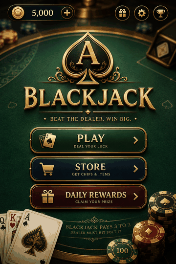
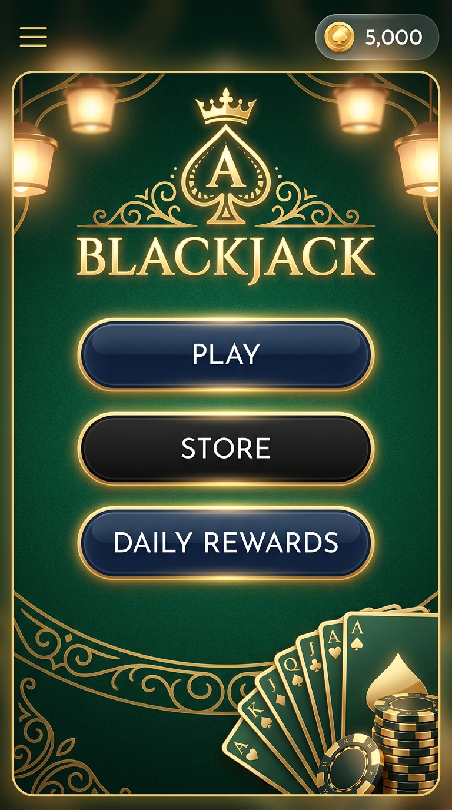
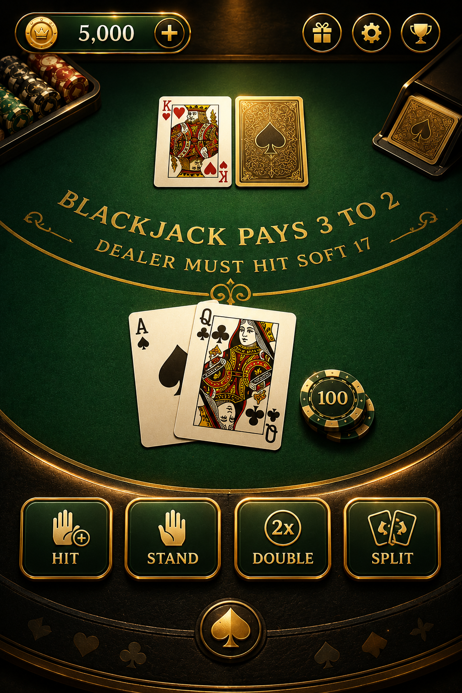
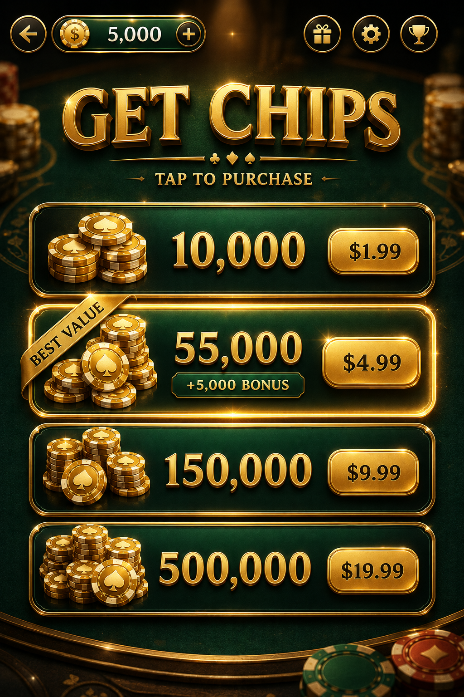

# 🂡 Social Casino Blackjack

[](LICENSE)
[](https://unity.com/releases/lts)
[](https://learn.microsoft.com/dotnet/csharp/)
[](https://nodejs.org/)
[](#)

A cross-platform (iOS + Android) **social casino** blackjack game built with **Unity** and
**C#**, backed by a lightweight **Node.js / Express** stub API.

> **Social casino — virtual chips only.** There is no real-money wagering, no cash
> payouts, and no way to cash out. Chips have no monetary value. In-app purchases are
> currently **mock placeholders** only.

---

## 🎯 Project Goal

Provide a clean, modular, production-ready **foundation** for a blackjack game:

- A rules-agnostic, unit-testable blackjack engine (pure C#, no Unity dependencies).
- A virtual chip economy with daily rewards and a mock store.
- A thin Unity UI layer (Main Menu → Game Table → Store).
- A scaffolded backend for player profiles and chip balances.

---

## 📸 Screenshots

<p align="center">
  
</p>

<p align="center"><sub>Animated preview cycling the three core screens. UI concept mockups.</sub></p>

| Main Menu | Game Table | Store |
| :---: | :---: | :---: |
|  |  |  |
| Play · Store · Daily Rewards | Hit / Stand / Double / Split | Mock chip packs |

---

## 🛠️ Tech Stack

| Layer          | Technology                                  |
| -------------- | ------------------------------------------- |
| Game Engine    | Unity (6000.0 LTS / Unity 6)                |
| Language       | C# (.NET Standard 2.1)                       |
| Architecture   | Modular, dependency-injected, event-driven  |
| UI             | Unity UGUI                                   |
| Backend (stub) | Node.js + Express                           |
| Persistence    | Local: `PlayerPrefs` (JSON) · Server: in-memory (placeholder) |
| Version Control | Git + GitHub                               |

---

## 📁 Project Structure

```
blackjack-social-casino/
├── Assets/
│   ├── Scripts/
│   │   ├── Core/            # AppManager (composition root), GameManager (table flow)
│   │   ├── Blackjack/       # Engine, DealerAI, HandEvaluator
│   │   │   ├── Cards/       # Card, Deck (Fisher-Yates), Hand
│   │   │   └── Rules/       # IRuleSet + ClassicRules, EuropeanRules
│   │   ├── Economy/         # ChipManager, RewardSystem, StoreManager
│   │   ├── Player/          # PlayerData (serializable), PlayerProfile (persistence)
│   │   ├── UI/
│   │   │   ├── Screens/     # MainMenuUI, GameTableUI, StoreUI
│   │   │   └── Components/  # ChipBalanceView (reusable)
│   │   ├── Config/          # GameConfig, EconomyConfig (ScriptableObjects)
│   │   ├── Utils/           # IRandomProvider, MonoSingleton
│   │   └── BlackjackGame.asmdef
│   ├── Tests/EditMode/      # NUnit tests for the pure core
│   ├── Prefabs/
│   └── Scenes/              # MainMenu.unity, Game.unity, Store.unity
├── Packages/manifest.json
├── ProjectSettings/ProjectVersion.txt
├── backend/                # Node.js + Express stub API
│   ├── server.js
│   ├── config/             # db (in-memory placeholder)
│   ├── models/             # Player
│   ├── controllers/        # player, auth (placeholder)
│   └── routes/             # /api/players, /api/auth
├── docs/ARCHITECTURE.md
├── .gitignore
└── README.md
```

---

## 🏛️ Architecture Highlights

- **Pure core, Unity shell.** `BlackjackEngine`, `HandEvaluator`, `Deck`, and the rule
  sets have **zero Unity dependencies**, so they can be unit-tested headlessly and later
  mirrored on an authoritative server.
- **Rules as a strategy.** New variants implement `IRuleSet`; the engine never changes.
  `ClassicRules` (Vegas) and `EuropeanRules` (no-hole-card) ship as examples.
- **Single composition root.** `AppManager` builds and owns the shared services
  (profile, chips, rewards, store) once; everything else receives them.
- **Event-driven UI.** UI reflects engine/economy state via C# events — it never
  re-implements game rules.
- **No hardcoded balance values.** Chip denominations, bet limits, starting balance,
  daily-reward ladder, and store packs all live in `GameConfig` / `EconomyConfig`
  ScriptableObjects.

See [`docs/ARCHITECTURE.md`](docs/ARCHITECTURE.md) for more.

---

## 🚀 Getting Started

### 1. Unity client

**Requirements:** Unity **6000.0 LTS** (Unity 6) with the Android and iOS build modules.

1. Open **Unity Hub → Add → select the `blackjack-social-casino/` folder**.
2. On first open, Unity imports packages and **generates `.meta` files** for all assets
   (this repo intentionally ships without them since it was scaffolded outside the
   editor). Commit the generated `.meta` files afterwards.
3. Create the config assets:
   - `Assets ▸ Create ▸ Blackjack ▸ Game Config`
   - `Assets ▸ Create ▸ Blackjack ▸ Economy Config`
4. In the **MainMenu** scene, add an empty GameObject, attach **`AppManager`**, and
   assign the two config assets in the inspector.
5. Build UI in each scene (Canvas + buttons/labels) and wire the serialized fields on
   `MainMenuUI`, `GameTableUI`, and `StoreUI`.
6. Add the three scenes to **File ▸ Build Settings** in order: MainMenu, Game, Store.
7. Press **Play** from the MainMenu scene.

> The scenes ship as valid but empty Unity scenes so the project opens cleanly; the UI
> GameObjects are assembled in the editor (step 5).

### 2. Backend (stub API)

**Requirements:** Node.js **18+**.

```bash
cd backend
npm install
cp .env.example .env
npm run dev        # or: npm start
```

The API starts on `http://localhost:3000`.

#### Endpoints

| Method | Path                          | Description                          |
| ------ | ----------------------------- | ------------------------------------ |
| GET    | `/`                           | Health check                         |
| POST   | `/api/auth/guest`             | Placeholder guest login (fake token) |
| POST   | `/api/players`                | Create a player profile              |
| GET    | `/api/players/:id`            | Get a player profile                 |
| GET    | `/api/players/:id/chips`      | Get chip balance                     |
| PATCH  | `/api/players/:id/chips`      | Adjust chips (`{ delta }` or `{ chips }`) |

A demo player (`demo-player`) is seeded on startup:

```bash
curl http://localhost:3000/api/players/demo-player/chips
```

> ⚠️ The backend is a **scaffold**: auth is a placeholder with no real security, and data
> is stored in memory (resets on restart). Replace `config/db.js` and
> `controllers/authController.js` before production.

---

## 🧪 Tests

Open **Window ▸ General ▸ Test Runner ▸ EditMode** in Unity and run all tests. The
`BlackjackGame.Tests` assembly covers hand evaluation (soft/hard aces, naturals) and deck
integrity.

---

## 🗺️ Roadmap / TODO

- [ ] Real IAP (Unity IAP / StoreKit / Google Play Billing) with receipt validation.
- [ ] Real authentication (Firebase Auth / JWT) replacing the placeholder.
- [ ] Server-authoritative shuffles + balance to prevent cheating.
- [ ] Card art, table prefabs, and animations.
- [ ] Split-hand payout polish and insurance/surrender UI.
- [ ] Persistent database for the backend.

---

## 📄 License

Released under the [MIT License](LICENSE).
