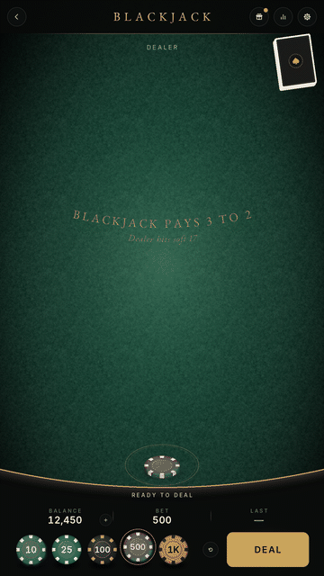
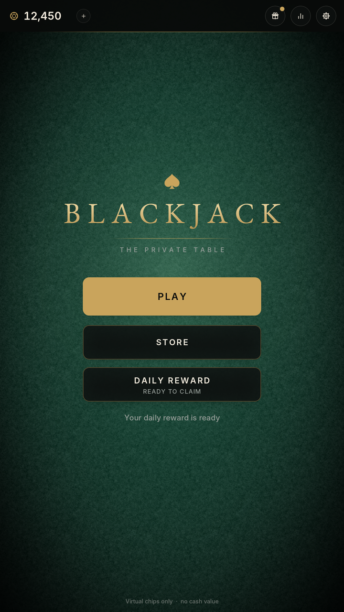
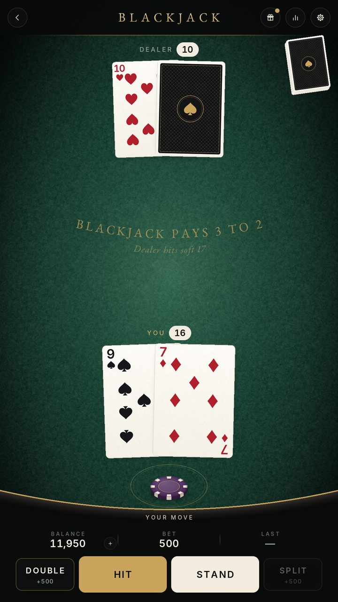
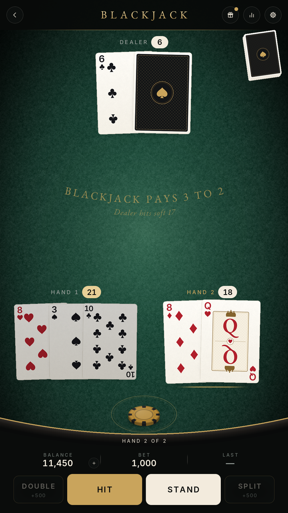
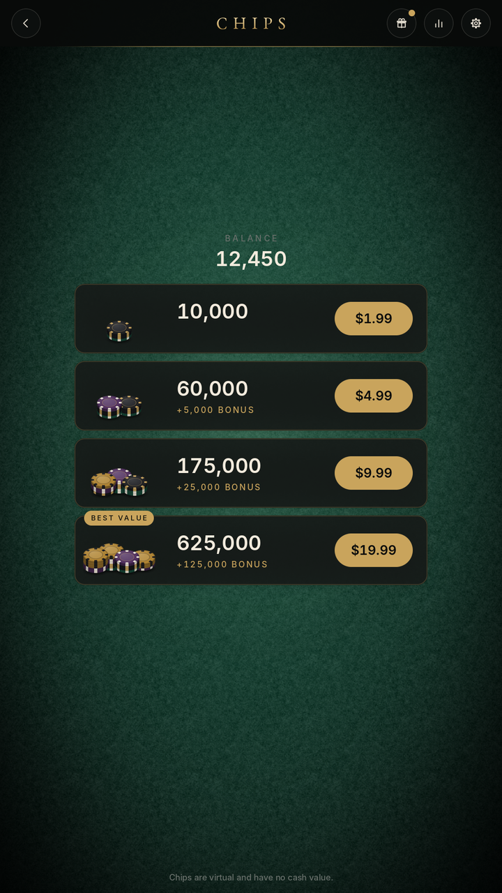
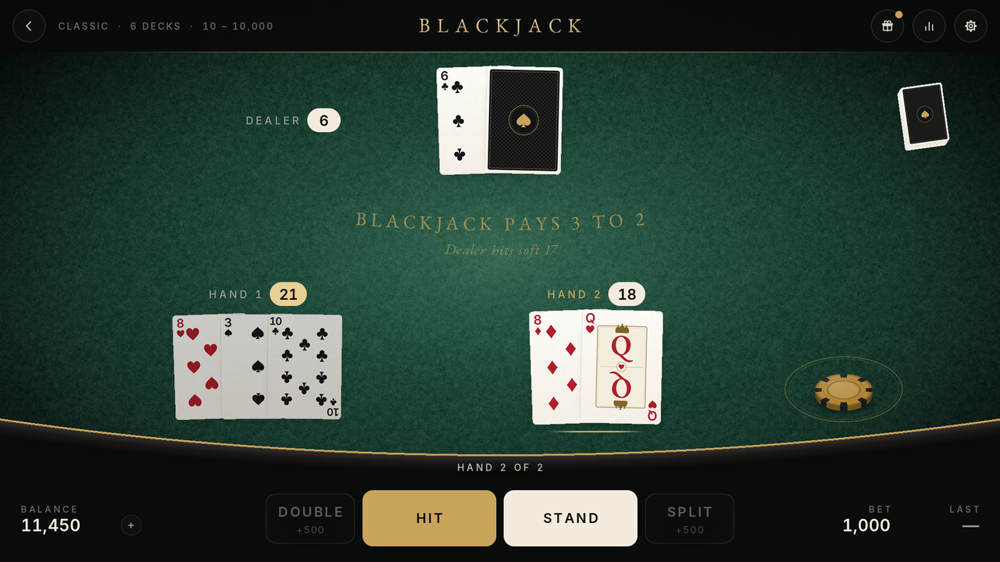

# 🂡 Social Casino Blackjack

[](LICENSE)
[](https://unity.com/releases/lts)
[](https://learn.microsoft.com/dotnet/csharp/)
[](https://nodejs.org/)
[](#)

A cross-platform (iOS + Android) **social casino** blackjack game built with **Unity** and
**C#**, backed by a lightweight **Node.js / Express** stub API.

> **Social casino — virtual chips only.** There is no real-money wagering, no cash
> payouts, and no way to cash out. Chips have no monetary value. In-app purchases are
> currently **mock placeholders** only.

---

## 🎯 Project Goal

Provide a clean, modular, production-ready **foundation** for a blackjack game:

- A rules-agnostic, unit-testable blackjack engine (pure C#, no Unity dependencies).
- A virtual chip economy with daily rewards and a mock store.
- A premium, responsive Unity UI (Main Menu → Game Table → Store) that shows the engine's
  state and never re-implements its rules.
- A scaffolded backend for player profiles and chip balances.

---

## 📸 Screenshots

<p align="center">
  
</p>

<p align="center"><sub>A round from bet to payout. Rendered from the layout spec by
<code>art-source/preview_premium_table.py</code>, a line-for-line port of <code>TableLayout</code>.</sub></p>

| Main Menu | Game Table | Split Hands | Store |
| :---: | :---: | :---: | :---: |
|  |  |  |  |
| Play · Store · Daily reward | Hit / Stand / Double / Split | Each hand gets its own seat | Mock chip packs |

<p align="center">
  
</p>
<p align="center"><sub>The same table in landscape: the totals move beside the hands and the controls fill a single dock.</sub></p>

---

## 🛠️ Tech Stack

| Layer          | Technology                                  |
| -------------- | ------------------------------------------- |
| Game Engine    | Unity (6000.0 LTS / Unity 6)                |
| Language       | C# (.NET Standard 2.1)                       |
| Architecture   | Modular, dependency-injected, event-driven  |
| UI             | Unity UGUI + TextMeshPro (EB Garamond, Inter) |
| Backend (stub) | Node.js + Express                           |
| Persistence    | Local: `PlayerPrefs` (JSON) · Server: in-memory (placeholder) |
| Version Control | Git + GitHub                               |

---

## 📁 Project Structure

```
blackjack-social-casino/
├── Assets/
│   ├── Scripts/
│   │   ├── Core/            # AppManager (composition root), GameManager (table flow)
│   │   ├── Blackjack/       # Engine, DealerAI, HandEvaluator
│   │   │   ├── Cards/       # Card, Deck (Fisher-Yates), Hand
│   │   │   └── Rules/       # IRuleSet + ClassicRules, EuropeanRules
│   │   ├── Economy/         # ChipManager, RewardSystem, StoreManager
│   │   ├── Player/          # PlayerData (serializable), PlayerProfile (persistence)
│   │   ├── UI/
│   │   │   ├── Screens/     # MainMenuUI, GameTableUI, StoreUI
│   │   │   ├── Components/  # HandView, BetChipView, ResultBanner, TotalBadge, ChipButton…
│   │   │   ├── Layout/      # TableLayout (pure, responsive) + TableLayoutDriver
│   │   │   ├── Presentation/# TableText: totals, verdicts, amounts (pure)
│   │   │   ├── Interaction/ # Keyboard navigation, shortcuts, focus-visible
│   │   │   ├── Feedback/    # UiCues: sound-ready event hub (no audio)
│   │   │   └── Theme/       # Palette, Ease, MotionPrefs (reduced motion)
│   │   ├── Config/          # GameConfig, EconomyConfig (ScriptableObjects)
│   │   ├── Utils/           # IRandomProvider, MonoSingleton
│   │   └── BlackjackGame.asmdef
│   ├── Editor/              # SceneBootstrap (builds + wires the scenes), FontAssetBuilder
│   ├── Tests/EditMode/      # NUnit: engine, table text, responsive layout
│   ├── Tests/PlayMode/      # Scene smoke tests: bet → deal → play → settle
│   ├── Art/                 # Cards, Chips, Table, UI kit (generated, see art-source/)
│   ├── Fonts/               # EB Garamond + Inter (OFL), figure styles pre-baked
│   ├── Prefabs/
│   └── Scenes/              # MainMenu.unity, Game.unity, Store.unity
├── Packages/manifest.json
├── ProjectSettings/ProjectVersion.txt
├── backend/                # Node.js + Express stub API
│   ├── server.js
│   ├── config/             # db (in-memory placeholder)
│   ├── models/             # Player
│   ├── controllers/        # player, auth (placeholder)
│   └── routes/             # /api/players, /api/auth
├── art-source/             # Python/Pillow generators for all art + the layout previewer
├── docs/ARCHITECTURE.md
├── .gitignore
└── README.md
```

---

## 🏛️ Architecture Highlights

- **Pure core, Unity shell.** `BlackjackEngine`, `HandEvaluator`, `Deck`, and the rule
  sets have **zero Unity dependencies**, so they can be unit-tested headlessly and later
  mirrored on an authoritative server.
- **Rules as a strategy.** New variants implement `IRuleSet`; the engine never changes.
  `ClassicRules` (Vegas) and `EuropeanRules` (no-hole-card) ship as examples.
- **Single composition root.** `AppManager` builds and owns the shared services
  (profile, chips, rewards, store) once; everything else receives them.
- **Event-driven UI.** UI reflects engine/economy state via C# events — it never
  re-implements game rules. The engine settles a round instantly; the table only paces
  the reveal (hole card, dealer draws, verdict, chips).
- **No hardcoded balance values.** Chip denominations, bet limits, starting balance,
  daily-reward ladder, and store packs all live in `GameConfig` / `EconomyConfig`
  ScriptableObjects.

See [`docs/ARCHITECTURE.md`](docs/ARCHITECTURE.md) for more.

---

## 🎨 The Table

A quiet, physical-feeling table: black room, emerald felt, gold used only as an accent,
ivory type. EB Garamond sets the wordmark and verdicts; Inter handles everything you
read quickly. Its digits are tabular, so balances roll without jitter.

- **Cards** deal from the shoe on an arc and flip in real 3D. The hole card turns over
  more slowly. Finished hands are swept to the discard tray.
- **Chips** stack physically on the bet spot, fly in from the rack, and at the end of
  the round are paid, returned, or swept.
- **Results** appear in a slim banner across the felt, not a modal. Headlines are
  BLACKJACK, YOU WIN, PUSH, BUST or DEALER WINS, each with a one-line reason and the
  signed amount. Split hands get their own result tags.
- **Responsive.** One pure layout (`TableLayout`) serves phones, tablets, foldables,
  desktop and 21:9. It handles notches and home indicators, fits up to four split
  hands, and keeps every card index readable. EditMode tests sweep every aspect ratio
  from 21:9 to tall phones.
- **Accessible.** Keyboard navigation with a focus ring that appears only for
  keyboard use. **Settings ▸ Reduce Motion** shortens animations and removes the travel.
  Disabled states are drawn distinctly.
- **Sound-ready.** Every moment raises a `UiCue` (card deal/flip, chip place/collect,
  win, bust…). No audio ships; subscribe a player to `UiCues.Raised` to add it.

### Keyboard

| Key | Action |
| --- | --- |
| `1`–`9` | Add a chip (smallest to largest) |
| `Backspace` / `Delete` | Clear the bet |
| `Space` / `Enter` | Deal (when nothing is focused) |
| `H` · `S` · `D` · `P` · `R` | Hit · Stand · Double · Split · Surrender |
| `Tab` / `Shift+Tab`, arrows | Move focus |
| `Esc` | Close Settings / Stats |

---

## 🚀 Getting Started

### 1. Unity client

**Requirements:** Unity 6 (the project is saved with **6000.3**) with the Android and iOS
build modules.

1. Open **Unity Hub → Add → select the project folder**.
2. Run **Blackjack ▸ Build UI Scenes**. It generates the TextMeshPro font assets, fills
   the card and chip sprite libraries, builds the card prefab, and builds and wires
   `MainMenu`, `Game` and `Store`. It also registers the scenes in Build Settings.
   On Windows, `tools/3_bootstrap_and_test.bat` does the same headlessly, then runs
   the tests.
3. Press **Play** from the MainMenu scene.

> The scenes are generated from code (`Assets/Editor/SceneBootstrap.cs`), so they can
> be rebuilt at any time. If the scenes on disk are older than the builder, the editor
> offers to rebuild them. **Blackjack ▸ Verify Scene Wiring** reports any missing
> references.

#### Art & fonts

All art is generated, not hand-painted: cards, chips, felt, the UI kit and icons. Run
`python3 art-source/generate_premium_art.py` (Pillow) to regenerate it. To preview the
layout on eight device shapes without Unity, run
`python3 art-source/preview_premium_table.py`. Fonts are described in
[`Assets/Fonts/README.md`](Assets/Fonts/README.md).

### 2. Backend (stub API)

**Requirements:** Node.js **18+**.

```bash
cd backend
npm install
cp .env.example .env
npm run dev        # or: npm start
```

The API starts on `http://localhost:3000`.

#### Endpoints

| Method | Path                          | Description                          |
| ------ | ----------------------------- | ------------------------------------ |
| GET    | `/`                           | Health check                         |
| POST   | `/api/auth/guest`             | Placeholder guest login (fake token) |
| POST   | `/api/players`                | Create a player profile              |
| GET    | `/api/players/:id`            | Get a player profile                 |
| GET    | `/api/players/:id/chips`      | Get chip balance                     |
| PATCH  | `/api/players/:id/chips`      | Adjust chips (`{ delta }` or `{ chips }`) |

A demo player (`demo-player`) is seeded on startup:

```bash
curl http://localhost:3000/api/players/demo-player/chips
```

> ⚠️ The backend is a **scaffold**: auth is a placeholder with no real security, and data
> is stored in memory (resets on restart). Replace `config/db.js` and
> `controllers/authController.js` before production.

---

## 🧪 Tests

Open **Window ▸ General ▸ Test Runner** in Unity and run all tests.

- **EditMode** — hand evaluation and deck integrity, the table text (totals, verdicts,
  signed amounts), and the responsive layout. The layout tests sweep aspect ratios from
  21:9 to tall phones with insets, and check that hands never overlap, controls stay
  thumb-sized, and split-hand indices stay visible.
- **PlayMode** — drives the real scenes from the main menu: bet a chip, deal, hit/stand,
  wait for the settle sequence, and check the balance label against `ChipManager`.
  Also covers the store's mock purchase.

---

## 🗺️ Roadmap / TODO

- [x] Real IAP (Unity IAP / StoreKit / Google Play Billing) with receipt validation. — see [docs/IAP.md](docs/IAP.md)
- [ ] Real authentication (Firebase Auth / JWT) replacing the placeholder.
- [ ] Server-authoritative shuffles + balance to prevent cheating.
- [x] Card art, table, and animations.
- [x] Split-hand presentation and surrender UI (shown when the rule set allows it).
- [ ] Insurance (needs engine support first).
- [ ] Audio: subscribe a sound player to `UiCues.Raised`.
- [ ] Persistent database for the backend.

---

## 📄 License

Released under the [MIT License](LICENSE).
